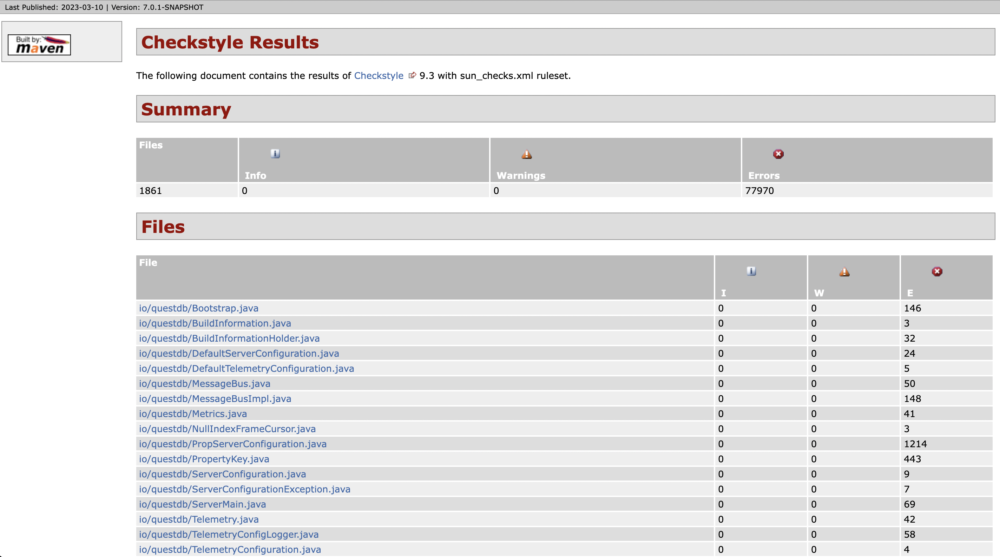

<div align="center">
  <a href="https://questdb.io/" target="blank"></a>
</div>
<p>&nbsp;</p>

# SWE 261P Project Part 6: Static Analyzers OR Mutation Testing of QuestDB

**Team Member: Jane He, Fengnan Sun, Ming-Hua Tsai**

**GitHub username: [SiyaoIsHiding](https://github.com/SiyaoIsHiding), [SoniaSun810](https://github.com/SoniaSun810), [alimhtsai](https://github.com/alimhtsai)**

**Table of Contents**
+ [1. Static Analyzers](#1-static-analyzers)
+ [2. Implementation of SpotBugs](#2-implementation-of-spotBugs)
  + [2.1 Introduction of SpotBugs](#21-introduction-of-spotBugs)
  + [2.2 The result of SpotBugs](#22-the-result-of-spotBugs)
    + [2.2.1 Bad Practice Warnings: 18 items](#221-bad-practice-warnings-:18-items)
    + [2.2.2 Correctness Warnings: 90 items](#222-correctness-warnings-:90-items)
    + [2.2.3 Internationalization Warnings: 3 items](#223-internationalization-warnings-:3-items)
    + [2.2.4 Malicious code vulnerability Warnings: 571 items](#224-malicious-code-vulnerability-warnings-:571-items)
    + [2.2.5 Multithreaded correctness Warnings: 1 item](#225-multithreaded-correctness-warnings-:1-item)
    + [2.2.6 Performance Warnings: 14 items](#226-performance-warnings-:14-items)
    + [2.2.7 Dodgy code Warnings: 117 items](#227-dodgy-code-warnings-:117-items)
+ [3. Implementation of Checkstyle](#3-implementation-of-checkstyle)
  + [3.1 Introduction of Checkstyle](#31-introduction-of-checkstyle)
  + [3.2 The result of Checkstyle](#32-the-result-of-checkstyle)
    + [3.2.1 “Error” Analysis of BinarySearch Class](#321-“Error”-analysis-of-binarySearch-class)
    + [3.2.2 Not Real Errors but Violate sun_check Rules](#322-not-real-errors-but-violate-sun_check-rules)
+ [4. Comparison of SpotBugs and CheckStyle](#4-comparison-of-spotBugs-and-checkStyle)
  + [4.1 Same Warning on Hidden Field `txn`](#41-same-warning-on-hidden-field-`txn`)
  + [4.2 Distinct Warnings](#42-distinct-warnings)

---
<p style="page-break-after:always"></p>

# 1. Static Analyzers

Static analysis tools, also known as static analyzers or compile-time analysis, are software programs that examine source code or compiled object code without actually executing it. These tools examine the code to identify potential errors, security vulnerabilities, and other issues that could cause problems in the program's behavior.

The primary purposes of static analysis tools are to:

1. **Improve code quality**: Static analysis tools help developers identify potential issues in their code before it is executed. This reduces the likelihood of bugs and other issues appearing in the final product, improving the overall quality of the code.
2. **Enhance security**: Static analysis tools can detect potential security vulnerabilities in code, such as buffer overflows, input validation issues, and SQL injection attacks. By detecting these issues early in the development process, developers can address them before they become real security threats.
3. **Increase productivity**: By detecting potential issues early in the development process, developers can save time and effort that would otherwise be spent on debugging and fixing errors.

Static analysis tools can be used in a variety of ways, including:

1. **Code reviews**: Static analysis tools can be used to perform automated code reviews, which can identify potential issues that may have been missed during manual code reviews.
2. **Continuous Integration/Continuous Delivery (CI/CD)**: Static analysis tools can be integrated into CI/CD pipelines to identify issues in code before it is deployed to production. This helps ensure that software is of high quality and free from vulnerabilities.
3. **Compliance**: Static analysis tools can be used to ensure that code meets certain compliance standards, such as those set forth by regulatory bodies or industry organizations.

# 2. Implementation of SpotBugs

## 2.1 Introduction of SpotBugs

[SpotBugs](https://spotbugs.github.io/) is an open-source static code analysis tool designed to find potential bugs in Java code. It is distributed under the terms of the [GNU Lesser General Public License](http://www.gnu.org/licenses/lgpl.html). It uses advanced algorithms to analyze Java bytecode and identify various types of issues such as null pointer dereferences, deadlocks, infinite loops, and more. 

In this report, we use the [SpotBugs](https://plugins.jetbrains.com/plugin/14014-spotbugs) plugins provided in the Intellij marketplace to identify potential errors in QuestDB. 

## 2.2 The result of SpotBugs

The output was generated by SpotBugs 4.4.2, which primarily analyzed the core project located in the root directory (questdb_test_debug/core). Based on the "Metrics" report, the analysis covered 135,895 lines of code across 2,795 classes and 74 packages. The "Summary" indicates that a total of 814 warnings were detected. The definitions of each warning are:

- [Bad practice Warnings](https://spotbugs.readthedocs.io/en/latest/bugDescriptions.html#bad-practice-bad-practice): There are 18 warnings were found. It refers to violations of recommended and essential coding practice. Examples include hash code and equals problems, cloneable idiom, dropped exceptions, Serializable problems, and misuse of finalize. We strive to make this analysis accurate, although some groups may not care about some of the bad practices.
- [Correctness Warnings](https://spotbugs.readthedocs.io/en/latest/bugDescriptions.html#correctness-correctness): There are 90 warnings were found. It refers to probable bug - an apparent coding mistake resulting in code that was probably not what the developer intended. We strive for a low false positive rate.
- [Internationalization Warnings](https://www.notion.so/SWE-261P-Project-Part-6-Static-Analyzers-OR-Mutation-Testing-of-QuestDB-a4af3cb74019483b8b49722c0b61d6fb): There are 3 warnings were found. It refers to code flaws having to do with internationalization and locale.
- [Malicious code vulnerability Warnings](https://spotbugs.readthedocs.io/en/latest/bugDescriptions.html#malicious-code-vulnerability-malicious-code): There are 571 warnings were found. It refers to code that is vulnerable to attacks from untrusted code.
- [Multithreaded correctness Warnings](https://spotbugs.readthedocs.io/en/latest/bugDescriptions.html#multithreaded-correctness-mt-correctness): There are 1 warning was found. It refers to code flaws having to do with threads, locks, and volatiles.
- [Performance Warnings](https://spotbugs.readthedocs.io/en/latest/bugDescriptions.html#performance-performance): There are 14 warnings were found. It refers to code that is not necessarily incorrect but may be inefficient.
- [Dodgy code Warnings](https://spotbugs.readthedocs.io/en/latest/bugDescriptions.html#dodgy-code-style): There are 117 warnings were found. It refers to code that is confusing, anomalous, or written in a way that leads itself to errors. Examples include dead local stores, switch fall through, unconfirmed casts, and redundant null check of value known to be null. More false positives accepted. In previous versions of SpotBugs, this category was known as Style.

In the following chapters, we selected some of the most common warnings of each type to discuss in further detail.

**Metrics**

135,895 lines of code analyzed, in 2,795 classes, in 74 packages.

| Metric                   | Total | Density* |
| ------------------------ | ----- | -------- |
| High Priority Warnings   | 78    | 0.57     |
| Medium Priority Warnings | 736   | 5.42     |
| Total Warnings           | 814   | 5.99     |

*(* Defects per Thousand lines of non-commenting source statements)*

**Summary**

| Warning Type                          | Number |
| ------------------------------------- | ------ |
| Bad Practice Warnings                 | 18     |
| Correctness Warnings                  | 90     |
| Internationalization Warnings         | 3      |
| Malicious code vulnerability Warnings | 571    |
| Multithreaded correctness Warnings    | 1      |
| Performance Warnings                  | 14     |
| Dodgy code Warnings                   | 117    |
| Total                                 | 814    |

### 2.2.1 Bad Practice Warnings: 18 items

- **Class defines equals() and uses Object.hashCode(): 3 items, high priority warning**

| Warning | Priority | Details |
| --- | --- | --- |
| Class defines equals() and uses Object.hashCode() | High | io.questdb.std.BoolList defines equals and uses Object.hashCode() |

```java
public class BoolList implements Mutable {
	...
	@Override
	public boolean equals(Object that) {
	    return this == that || that instanceof BoolList && equals((BoolList) that);
	}
	...
}
```

This class overrides `equals(Object)`, but does not override `hashCode()`, and inherits the implementation of `hashCode()` from `java.lang.Object` (which returns the identity hash code, an arbitrary value assigned to the object by the VM).  Therefore, the class is very likely to violate the invariant that equal objects must have equal hashcodes.

If you don't think instances of this class will ever be inserted into a HashMap/HashTable, the recommended `hashCode` implementation to use is:

```java
public int hashCode() {
    assert false : "hashCode not designed";
    return 42; // any arbitrary constant will do
}
```

if a class overrides the `equals()` method, it is important to also provide a proper implementation for `hashCode()` to avoid issues when using hash-based data structures. If a proper implementation cannot be provided, the recommended implementation is to throw an assertion error and return an arbitrary constant value.

In this case, we think that **this is not an actual problem, but it is better to revise the code.** 

### 2.2.2 Correctness Warnings: 90 items

- **Method may return null, but is declared @Nonnull: 36 items, high priority warning**

| Warning | Priority | Details |
| --- | --- | --- |
| Method may return null, but is declared @Nonnull | High | io.questdb.PropServerConfiguration$PropSqlExecutionCircuitBreakerConfiguration.getClock() may return null, but is declared @Nonnull |

```java
private class PropSqlExecutionCircuitBreakerConfiguration implements SqlExecutionCircuitBreakerConfiguration {
	...
	@Override
	@NotNull
	public MillisecondClock getClock() {
	    return MillisecondClockImpl.INSTANCE;
	}
	...
}
```

This method may return a null value, but the method (or a superclass method which it overrides) is declared to return @Nonnull. In this case, we think that **this is an actual problem**.

### 2.2.3 Internationalization Warnings: 3 items

- **Reliance on default encoding: 3 items, high priority warning**

| Warning | Priority | Details |
| --- | --- | --- |
| Reliance on default encoding | High | Found reliance on default encoding in io.questdb.Bootstrap.getPublicVersion(String): new String(byte[], int, int) |

```java
public class Bootstrap {
	...
	private static String getPublicVersion(String publicDir) throws IOException {
      File f = new File(publicDir, PUBLIC_VERSION_TXT);
      if (f.exists()) {
          try (FileInputStream fis = new FileInputStream(f)) {
              byte[] buf = new byte[128];
              int len = fis.read(buf);
              return new String(buf, 0, len);
          }
      }
      return null;
  }
	...
}
```

Found a call to a method which will perform a byte to String (or String to byte) conversion, and will assume that the default platform encoding is suitable. This will cause the application behavior to vary between platforms. In this case, **we believe that this is an actual problem.** 

To fix this issue, it is recommended to use an alternative API that allows specifying the character encoding explicitly using a charset name or a Charset object. This will ensure consistent behavior across different platforms and environments. For example, modifying the code to:

```java
try (FileInputStream fis = new FileInputStream(f)) {
    byte[] buf = new byte[128];
    int len = fis.read(buf);
    Charset charset = StandardCharsets.UTF_8; // or another supported charset
    return new String(buf, 0, len, charset);
}
```

### 2.2.4 Malicious code vulnerability Warnings: 571 items

- **May expose internal representation by returning reference to mutable object: 278 items, medium priority warning**

| Warning | Priority | Details |
| --- | --- | --- |
| May expose internal representation by returning reference to mutable object | Medium | io.questdb.cairo.TableReaderSelectedColumnRecord.of(TableReader) may expose internal representation by storing an externally mutable object into TableReaderSelectedColumnRecord.reader |

```java
public class TableReaderSelectedColumnRecord implements Record {
	...
	public void of(TableReader reader) {
      this.reader = reader;
  }
	...
}
```

This code stores a reference to an externally mutable object into the internal representation of the object. If instances are accessed by untrusted code, and unchecked changes to the mutable object would compromise security or other important properties, you will need to do something different. In this case, **we believe that this is an actual problem.** 

To address this issue, it may be better to store a copy of the object instead of a reference to the original object. This would ensure that the internal representation of the object is not affected by any modifications made to the original object. However, making a copy of a large or complex object can be expensive in terms of memory and performance, so it may not be feasible in all situations.

Alternatively, we can use defensive copying to create a copy of the object only when necessary, such as when the object is passed to untrusted code. This approach can help minimize the performance and memory impact of making a copy, while still providing protection against unauthorized modifications to the object. For example, modifying the code with the defensive copying:

```java
public void of(TableReader reader) {
    this.reader = new TableReader(reader); // defensive copy
}
```

### 2.2.5 Multithreaded correctness Warnings: 1 item

- **Inconsistent synchronization: 1 item, medium priority warning**

| Warning | Priority | Details |
| --- | --- | --- |
| Inconsistent synchronization | Medium | Inconsistent synchronization of io.questdb.cairo.TableNameRegistryRO.nameTableTokenMap; locked 50% of time |

```java
public class TableNameRegistryRO extends AbstractTableNameRegistry {
	...
	private ConcurrentHashMap<TableToken> nameTableTokenMap = new ConcurrentHashMap<>(false);
	...
	@Override
  public TableToken getTableToken(CharSequence tableName) {
      TableToken record = nameTableTokenMap.get(tableName);
      if (record == null && clockMs.getTicks() - lastReloadTimestampMs > autoReloadTimeout) {
          reloadTableNameCacheThrottled();
          return nameTableTokenMap.get(tableName);
      }
      return record;
  }
	...
}
```

The fields of this class appear to be accessed inconsistently with respect to synchronization. This bug report indicates that the bug pattern detector judged that: 

- The class contains a mix of locked and unlocked accesses,
- The class is **not** annotated as javax.annotation.concurrent.NotThreadSafe,
- At least one locked access was performed by one of the class's own methods, and
- The number of unsynchronized field accesses (reads and writes) was no more than one third of all accesses, with writes being weighed twice as high as reads

A typical bug matching this bug pattern is forgetting to synchronize one of the methods in a class that is intended to be thread-safe.

However, the code appears to address the thread-safety issue by using a `ConcurrentHashMap` to store the `TableToken` objects. This data structure provides thread-safe access to the underlying map, eliminating the need for explicit synchronization. As a result, the `getTableToken` method should now be thread-safe, as multiple threads can safely access and modify the map concurrently without any risk of race conditions or inconsistencies. In this case, **we think that it is not an actual problem**.

### 2.2.6 Performance Warnings: 14 items

- **Explicit garbage collection; extremely dubious except in benchmarking code: 2 items, high priority warning**

| Warning | Priority | Details |
| --- | --- | --- |
| Explicit garbage collection; extremely dubious except in benchmarking code | High | new io.questdb.ServerMain(PropServerConfiguration, Metrics, Log, String) forces garbage collection; extremely dubious except in benchmarking code |

```java
public class ServerMain implements Closeable {
	...
	public ServerMain(final PropServerConfiguration config, final Metrics metrics, final Log log, String banner) {
		...
		System.gc(); // GC 1
	  log.advisoryW().$("bootstrap complete").$();
	}
	...
}
```

Code explicitly invokes garbage collection. Except for specific use in benchmarking, this is very dubious. In the past, situations where people have explicitly invoked the garbage collector in routines such as close or finalize methods has led to huge performance black holes. Garbage collection can be expensive. Any situation that forces hundreds or thousands of garbage collections will bring the machine to a crawl.

However, there may be certain situations where invoking garbage collection can be helpful. For example, in applications with high memory usage or long-running processes, it may be useful to manually trigger garbage collection at certain intervals to prevent memory leaks or to ensure that memory is released in a timely manner.

According to [QuestDB](https://github.com/questdb/questdb/blob/master/CONTRIBUTING.md#allocations-new-operator-and-garbage-collection), it prioritizes zero-GC and has designed its system to minimize or even eliminate the amount of garbage collection needed during operation. Therefore, despite the fact that Spotbugs flagged it, **we do not consider it an actual problem** but rather a deliberate and carefully considered decision made by QuestDB.

### 2.2.7 Dodgy code Warnings: 117 items

- **Dead store to local variable that shadows field: 1 item, high priority warning**

| Warning | Priority | Details |
| --- | --- | --- |
| Dead store to local variable that shadows field | High | Dead store to txn rather than field with same name in io.questdb.cairo.TableReaderTailRecordCursor.reload() |

```java
public class TableReaderTailRecordCursor extends TableReaderRecordCursor { 
	...
	private long txn = TableUtils.INITIAL_TXN;
	...
	public boolean reload() {
    long txn;
    if (reader.reload()) {
        if (reader.getDataVersion() != this.dataVersion) {
            lastRowId = -1;
            dataVersion = reader.getDataVersion();
            toTop();
        } else {
            seekToLastSeenRow();
        }
        txn = reader.getTxn();
        return true;
    }

    // when reader is created against table that already has data
    // TableReader.reload() would return 'false'. This method
    // must return 'true' in those conditions

    txn = reader.getTxn();

    if (txn > this.txn) {
        this.txn = txn;
        seekToLastSeenRow();
        return true;
    }
    return false;
	}
	...
}
```

This instruction assigns a value to a local variable `txn`, but the value is not read or used in any subsequent instruction. Often, this indicates an error, because the value computed is never used. There is a field with the same name as the local variable. 

However, according to the code, it appears that the local variable `txn` is being used correctly in subsequent instructions. The first assignment of `txn` sets its value based on the result of calling the `getTxn()` method on the `reader` object, which is then used to compare with the `txn` field of the object.

In the case, **we believe this is not an actual problem**, as the code correctly uses the local variable `txn` to store the result of the method call and later compare it to the `txn` field of the object. 

# 3. Implementation of Checkstyle

## 3.1 Introduction of Checkstyle

[Checkstyle](https://checkstyle.org) is a static analysis tool used to ensure that Java code conforms to a set of coding standards and guidelines. It checks the source code against a set of predefined rules and generates a report of violations. Checkstyle can be used to improve the readability, maintainability, and overall quality of Java code. Some of the benefits of using Checkstyle include improving code readability, reducing the likelihood of introducing errors or inconsistencies, and making code easier to maintain. 

Main features of Checkstyle are as follows:

- Performs its analysis by parsing the Java source code and checking it against a set of pre-defined rules. These rules cover various aspects of coding standards, such as naming conventions, indentation, whitespace, and formatting.
- Can be integrated into various development environments, including IDEs like Eclipse and IntelliJ IDEA, and build tools like Maven and Gradle.
- Highly configurable, allowing users to customize the set of rules to be enforced according to their specific needs. It can also be extended with custom rules to cover domain-specific coding standards or best practices.
- Can detect certain logic mistakes in code, but **its primary purpose is to enforce coding conventions and style guidelines**. **It is not a substitute for unit testing or code analysis tools that are specifically designed to detect logic errors, bugs, or performance issues in code**. That being said, Checkstyle can help identify potential sources of bugs or readability issues in code, such as inconsistent naming conventions, unnecessary complexity, or code duplication.

## 3.2 The result of Checkstyle

The output was generated by Check 5.76.0, which primarily analyzed Java code in the core project located in the root directory (questdb_test_debug/core). The inspection result indicates that there are 77970 errors reported by Checkstyle 9.3 with sun_checks.xml ruleset in 1861 files. The report is located in `questdb_test_debug/core/target/site/checkstyle.html`. 

```bash
// Command line to run Checkstyle

➜  core git:(master) mvn checkstyle:checkstyle
[INFO] Scanning for projects...
[INFO]
[INFO] ------------------------< org.questdb:questdb >-------------------------
[INFO] Building QuestDB core 7.0.1-SNAPSHOT
[INFO] --------------------------------[ jar ]---------------------------------
[INFO]
[INFO] --- maven-checkstyle-plugin:3.2.1:checkstyle (default-cli) @ questdb ---
[INFO] Rendering content with org.apache.maven.skins:maven-default-skin:jar:1.3 skin.
[INFO] There are 77970 errors reported by Checkstyle 9.3 with sun_checks.xml ruleset.
[WARNING] Unable to locate Source XRef to link to - DISABLED
[WARNING] Unable to locate Test Source XRef to link to - DISABLED
[INFO] ------------------------------------------------------------------------
[INFO] BUILD SUCCESS
[INFO] ------------------------------------------------------------------------
[INFO] Total time:  11.426 s
[INFO] Finished at: 2023-03-10T23:28:00-08:00
[INFO] ------------------------------------------------------------------------
➜  core git:(master)
```

As the figure below shows, in a Checkstyle report, each violation found is typically categorized by severity level into one of three categories: `info`, `warning`, or `error`.

Here's a brief explanation of each category:

- `info`: An informational message that does not necessarily indicate a problem with the code. For example, a violation might be categorized as “info” if it suggests a way to improve the code but is not strictly required.
- `warning`: A violation that indicates a potential problem with the code that could cause issues in the future. For example, a violation might be categorized as “warning” if it indicates a potential performance problem or a violation of best practices.
- `error`: A violation that indicates a problem with the code that needs to be fixed before the code can be considered correct. For example, a violation might be categorized as “error” if it indicates a violation of syntax or coding standards that could cause the code to behave incorrectly.

The severity level of each violation is typically indicated in the Checkstyle report using color coding or other visual indicators. In general, `error` violations should be addressed first, followed by `warning` violations, and then `info` violations if time permits. However, the severity of each violation should be considered in the context of the project's coding standards and priorities.

<p align="center">
  
</p>

As the report shows, Checkstyle has found a large number of errors (no “info” and “warning” here), specifically 77,970, which indicates that the project's codebase may need significant improvements to meet the specified coding standards. The predefined rulesets available for use in this version of the plugin are `[sun_checks.xml](https://checkstyle.org/sun_style.html)` and `[google_checks.xml](https://checkstyle.org/google_style.html)`, the default is sun_checks.xml. The number of “error” is extremely high, but it doesn’t mean they are actually errors in codes. 

As shown below, when we click the file name in checkstyle.html, we can read the detail of each “error”: severity, category, rule, and message. Let’s dive into the codes and analyze some of them. 

<p align="center">
  
</p>

```java
// src code of src/main/java/io/questdb/cairo/BinarySearch.java

package io.questdb.cairo;

import io.questdb.cairo.vm.api.MemoryR;

public class BinarySearch {
    // Down is increasing direction
    public static final int SCAN_DOWN = 1;
    // Up is decreasing direction
    public static final int SCAN_UP = -1;

    /**
     * Performs binary search on column of Long values.
     *
     * @param column        the column
     * @param value         the search value
     * @param low           the low boundary of the search, inclusive of value
     * @param high          the high boundary of the search inclusive of value
     * @param scanDirection logical direction in which column is searched. UP means we are looking for
     *                      the bottom boundary of the values that are lower or equal the search value. DOWN means
     *                      we are looking for upper boundary of the values that are greater or equal the search
     *                      value.
     * @return index in column where value is less or equal to the search value. If column contains
     * multiple exact matches the scanDirection determines whether top or bottom of these matches is returned.
     * When scan direction is DOWN - the last index of exact matches is returns, when UP - the first index
     */
    public static long find(MemoryR column, long value, long low, long high, int scanDirection) {
        while (low < high) {
            long mid = (low + high) / 2;
            long midVal = column.getLong(mid * Long.BYTES);

            if (midVal < value) {
                if (low < mid) {
                    low = mid;
                } else {
                    if (column.getLong(high * Long.BYTES) > value) {
                        return low;
                    }
                    return high;
                }
            } else if (midVal > value)
                high = mid;
            else {
                // In case of multiple equal values, find the first
                mid += scanDirection;
                while (mid > 0 && mid <= high && midVal == column.getLong(mid * Long.BYTES)) {
                    mid += scanDirection;
                }
                return mid - scanDirection;
            }
        }

        if (column.getLong(low * Long.BYTES) > value) {
            return low - 1;
        }
        return low;
    }
}
```

### 3.2.1 “Error” Analysis of BinarySearch Class

As the name “Checkstyle” suggests, this tool focuses more on the coding style of Java code rather than potential logic errors or warnings. 

Checkstyle works by analyzing Java code and generating a report that highlights any violations of the configured rules. The rules are defined in an XML file that can be customized to fit the needs of the project. The rules cover a wide range of coding standards and best practices, including naming conventions, indentation, whitespace, class design, and more.

Most of the error in report are not real logic errors, given `src/main/java/io/questdb/cairo/BinarySearch.java` as an Example:

- Error 1: Utility classes should not have a public or default constructor. Utility classes are typically used to group together related methods and constants that are used throughout a codebase. Since these classes do not represent objects with state, they do not need to be instantiated, and therefore it is common to make their constructors private or protected. We can disable the default constructor of this class using code below:

```java
private MyClass() {
    // private constructor to disable instantiation
}
```

- Error 2: Missing a Javadoc comment. `JavadocVariable` is a Checkstyle rule that checks whether each non-private instance variable in a Java class has a Javadoc comment. If a Javadoc comment is missing, the Checkstyle report will flag the violation as an error or a warning. The purpose of this rule is to encourage developers to document the purpose and usage of each instance variable in their code. This can improve code readability and help other developers understand the intended usage of each variable. In fact, the src code already wrote some comments for these variables, but not in a standard java comment method, which can be modified as:

```java
/**
 * Down is increasing direction
 */
public static final int SCAN_DOWN = 1;
/**
 * Up is decreasing direction
 */
public static final int SCAN_UP = -1;
```

- Error 3: Line shouldn’t be longer than 80 characters. Code lines that are too long can be difficult to read and understand, especially if they contain multiple expressions or nested statements. Keeping lines shorter makes it easier to follow the code and understand its structure.

- Error 4: Marking a parameter as `final`. The `FinalParameters`Checkstyle rule checks whether parameters of methods, constructors, and catch blocks are marked as `final`. in a Java method indicates that the value of the parameter cannot be changed within the method. This rule encourages good coding practices by enforcing the use of `final` parameters, which can lead to safer and more maintainable code. We add add “final” keyword in front of the parameter column.

```java
public static long find(final MemoryR column, long value, long low, long high, int scanDirection) { 
... }
```

### 3.2.2 Not Real Errors but Violate sun_check Rules

According to our report, examples of rules that Checkstyle enforces mainly include:

- Method names should follow camelCase convention
- Class names should start with an uppercase letter and use PascalCase convention
- The number of method parameters should not exceed a certain limit
- There should be no whitespace at the end of a line
- Imports should be sorted alphabetically
- Constant names should be in all uppercase letters and use underscores to separate words
- Braces should always be used, even for single-line statements
- Method parameters should be listed on separate lines when there are more than two parameters
- The code should not contain magic numbers (i.e. hard-coded numeric values)
- The code should not contain too many nested blocks (i.e. loops, conditionals, etc.)
- The code should not contain unused imports or variables
- Class members (i.e. fields and methods) should have an access modifier (i.e. public, private, protected, or package-private)

After running Checkstyle on the codebase, **no major logic errors or bugs were identified that required immediate attention**. The report generated by Checkstyle did not flag any critical issues that would prevent the code from functioning correctly, and instead focused on enforcing coding conventions and best practices to ensure readability and maintainability of the code.

While Checkstyle can help identify potential sources of bugs or issues, **its primary purpose is to ensure consistency and adherence to coding standards**. Therefore, not finding any major logic problems in the Checkstyle report is a positive sign, but **it does not necessarily mean that the code is bug-free or that there are no logical errors that require further investigation or testing**. It is important to use Checkstyle in conjunction with other tools and practices, such as unit testing, code reviews, and debugging, to ensure the overall quality and correctness of the code.

# 4. Comparison of SpotBugs and CheckStyle

Although SpotBugs and CheckStyle are both static analysis tools, they focus on different aspects of code quality and have different rule sets. As a result, their output on QuestDB have little overlap.

SpotBugs is a tool that identifies potential bugs in Java code. It analyses the bytecode of compiled Java classes to detect issues such as null pointer dereferences, use of uninitialized variables, and concurrency issues. SpotBugs uses a set of rules to identify these potential bugs, and the rules are customizable. The rules in SpotBugs are focused on finding issues related to code correctness, rather than style or formatting.

CheckStyle, on the other hand, is a tool that enforces coding conventions and style guidelines. It checks for issues such as indentation, naming conventions, and code layout. CheckStyle uses a set of rules to identify violations of these conventions, and the rules are also customizable. The rules in CheckStyle are focused on enforcing coding style guidelines, rather than finding potential bugs.

Because the rulesets for SpotBugs and CheckStyle are different, the issues that they identify in QuestDB have little overlap. Sometimes they found the same issue with different angles, as in the `txn` example demonstrated below.

## 4.1 Same Warning on Hidden Field `txn`

In the section 2.2.7 Dodgy code Warnings, we documented the warning raised by SpotBugs on the hidden `txn` field. CheckStyle also raises the same issue, in a slightly different way. 

```java
public boolean reload() {
    long txn;
    if (reader.reload()) {
        if (reader.getDataVersion() != this.dataVersion) {
            lastRowId = -1;
            dataVersion = reader.getDataVersion();
            toTop();
        } else {
            seekToLastSeenRow();
        }
        txn = reader.getTxn();
        return true;
    }

    txn = reader.getTxn();

    if (txn > this.txn) {
        this.txn = txn;
        seekToLastSeenRow();
        return true;
    }
    return false;
}
```

| Tools | Code | Warning |
| --- | --- | --- |
| SpotBugs | txn = reader.getTxn(); | Dead store to txn rather than field with same name |
| CheckStyle | long txn; | 'txn' hides a field. [HiddenField] |

This issue comes from QuestDB’s implementation that they create a local variable of `txn` and compare it with the `this.txn` to determine whether they should update `this.txn` to the local `txn`. It may be confusing. Both tools report this issue, while in a different way. The different output of SpotBugs and CheckStyle clearly demonstrate the different focus of SpotBugs and CheckStyle: 

- When storing the `reader.getTxn()` to the local `txn` but never use it later, they may mean to assign it to `this.txn` instead. This may be a source of bug, but nothing relevant to styling.
- When declaring a variable with the same name of a field `long txn;`, it is a naming problem. They can simply rename the local `txn` to another name like `localTxn` to make their codes clearer and more readable. It does not necessarily leads to a bug.

## 4.2 Distinct Warnings

As a tool to find bugs instead of styling, SpotBugs never identify:

- Magic numbers (hard-coded numbers)
- Long one-line code
- Missing documentation

As a tool to check styling conventions instead of source of bugs, CheckStyle never identify:

- Redundant Comparison to null
- Bad casts of object references
- Method may return null, but is declared @Notnull

To summarize, it's important to note that the two tools have different focus and both tools have their own strengths and weaknesses. Using both tools together can provide a more comprehensive analysis of code quality.